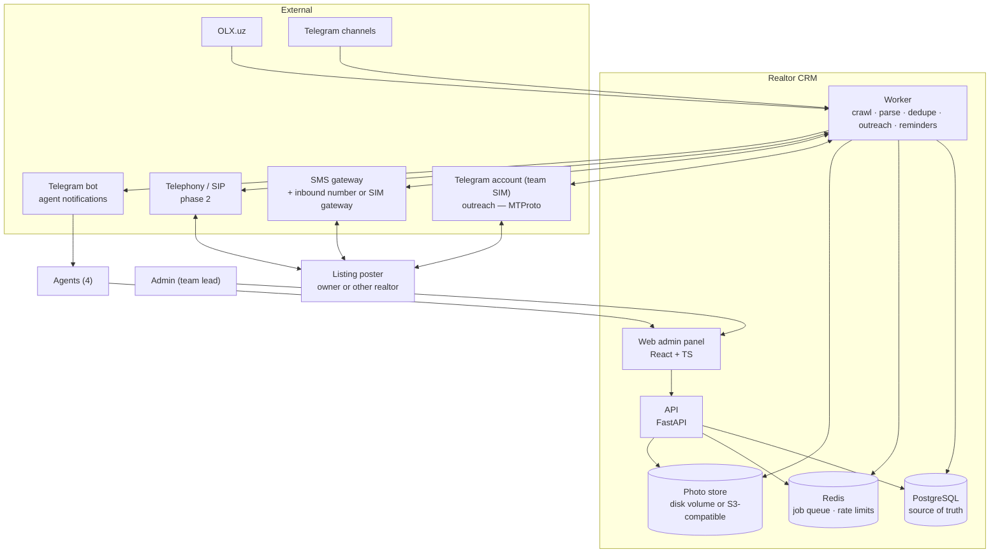
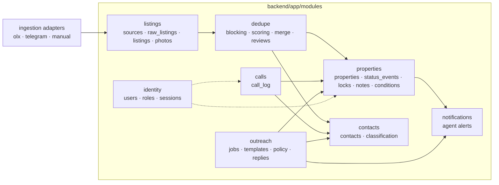
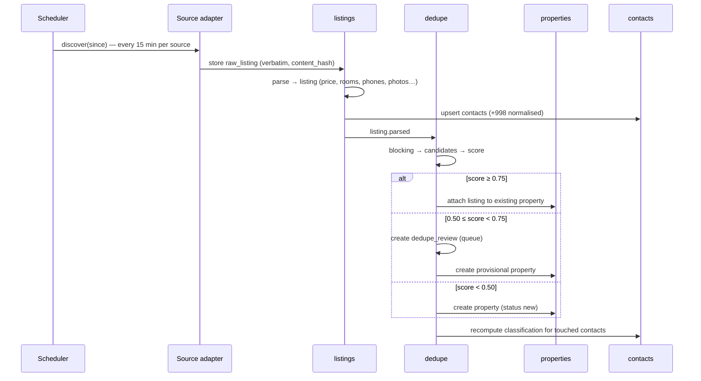
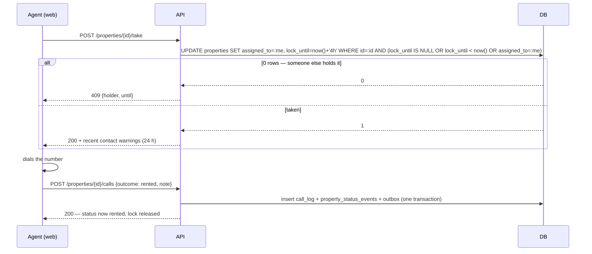
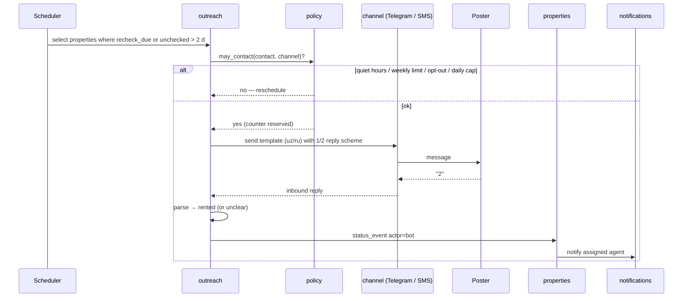
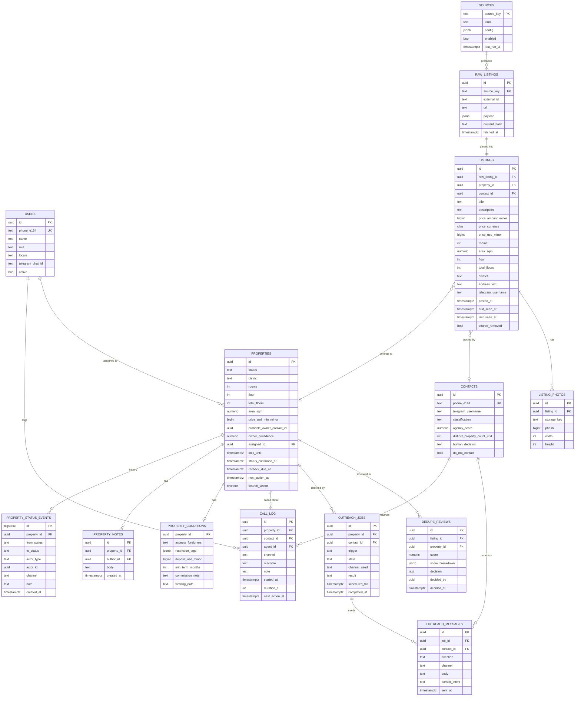
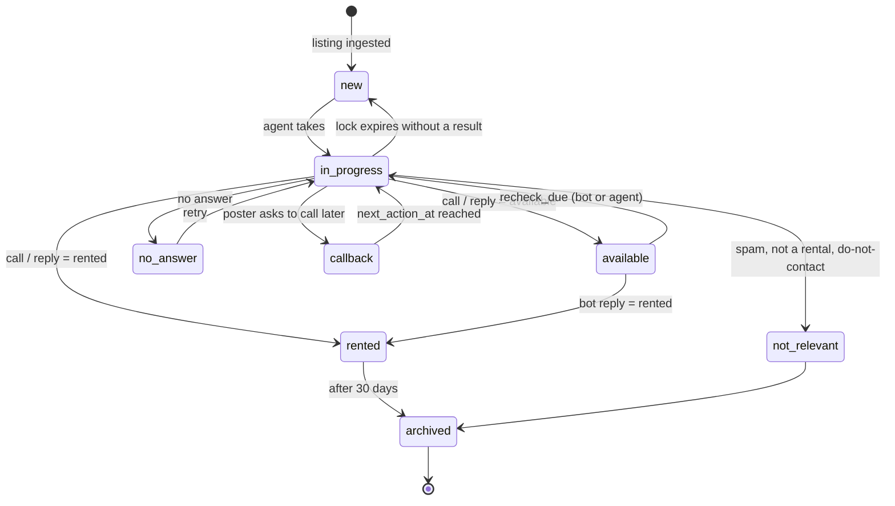

# Realtor CRM — Architecture

| | |
|---|---|
| **Status** | Draft v0.1 — 2026-08-29 · design, no code yet |
| **Shape** | One web admin panel · one backend (API + worker) · PostgreSQL · Redis |
| **Stack** | Python 3.12 / FastAPI · PostgreSQL 16 · Redis 7 · React + TypeScript (Vite) · Telegram · SMS gateway |
| **Scale target** | ≤ 20 users · ≤ 100 k listings · ≤ 5 k outreach messages / month — one server |
| **Companion** | [`01-requirements.md`](01-requirements.md) — FR-x references below point there |

---

## Contents

1. [Design principles](#1-design-principles)
2. [System context](#2-system-context)
3. [Components](#3-components)
4. [Modules and boundaries](#4-modules-and-boundaries)
5. [Key flows](#5-key-flows)
6. [Data model](#6-data-model)
7. [Deduplication and owner discovery](#7-deduplication-and-owner-discovery)
8. [Call coordination — locks](#8-call-coordination--locks)
9. [Outreach — the availability bot](#9-outreach--the-availability-bot)
10. [Ingestion](#10-ingestion)
11. [Web admin panel](#11-web-admin-panel)
12. [API surface](#12-api-surface)
13. [Repository layout](#13-repository-layout)
14. [Deployment](#14-deployment)
15. [Security, privacy and compliance](#15-security-privacy-and-compliance)
16. [Roadmap](#16-roadmap)
17. [Open decisions](#17-open-decisions)

---

## 1. Design principles

1. **Modular monolith.** One FastAPI deployable and one worker process, with modules that own their tables and talk through Python interfaces and domain events. Four users do not need microservices; they need something that ships in weeks and can be run by one person.
2. **The property is the unit of work; listings are evidence.** Agents take, call, and log against a *property*. Listings (adverts) hang off it and are what dedupe merges.
3. **Store raw before parsing.** Crawlers save the source payload verbatim; parsing is a separate step that can be re-run over history when it improves.
4. **Every change is an event with an actor.** Status, assignment and classification changes are append-only rows carrying `actor_type` (`agent`, `admin`, `bot`, `crawler`) and `actor_id`. The current state is a projection of them.
5. **Outreach is polite by construction.** Quiet hours, per-contact frequency, daily caps and opt-out live in the sender module and fail closed. No template or job can bypass them.
6. **Python for the pipeline** because the scraping and matching ecosystem is Python — Scrapling / ScrapeGraphAI for extraction, `imagehash` for photos, Telethon for Telegram, `phonenumbers` for `+998` normalisation.
7. **Boring infrastructure.** PostgreSQL does search (`pg_trgm`, full text), queues are Redis, files sit on a disk volume. Nothing that needs a second operator.

---

## 2. System context



Two Telegram integrations are deliberately separate. The **bot** talks to agents (they start it once, so it may message them). The **account** talks to listing posters, because a bot cannot open a conversation with someone who has never messaged it — see §9.

---

## 3. Components

| Component | Technology | Responsibility |
|---|---|---|
| **Web admin panel** | React 18, TypeScript, Vite, Tailwind, i18next (uz/ru) | Queue, property screen, call logging, duplicates review, bot monitor, settings. Mobile-first |
| **API** | FastAPI, SQLAlchemy 2 (async), Pydantic v2, Alembic | Auth, all reads/writes, lock semantics, event recording |
| **Worker** | Same codebase, separate process; `arq` (Redis-backed asyncio jobs) + scheduler | Crawls, parsing, photo hashing, dedupe, outreach sending, reply intake, re-check scheduling, reminders |
| **PostgreSQL 16** | extensions: `pg_trgm`, `unaccent`, `btree_gist` | All state; text similarity and full-text search |
| **Redis 7** | | Job queue, outreach rate-limit counters, short-lived caches |
| **Photo store** | Local volume in v1; S3-compatible (MinIO) if it outgrows one disk | Rehosted listing photos (source URLs expire) and call recordings later |
| **Telegram channels reader** | Telethon (MTProto) on public channels | Ingestion source |
| **Telegram outreach account** | Telethon on a dedicated team account | Messaging posters (FR-6) |
| **Telegram bot** | aiogram | Agent notifications, optional call logging commands |
| **SMS gateway** | Local provider (e.g. Eskiz.uz or Play Mobile — to be chosen) | Outbound SMS; inbound via provider number or an Android SIM gateway |
| **Telephony (phase 2)** | SIP trunk + Asterisk/FreeSWITCH, or a hosted voice API; TTS with uz/ru voices | Outbound availability calls with keypad answers |

---

## 4. Modules and boundaries



| Module | Owns tables | Publishes events | Notes |
|---|---|---|---|
| `identity` | `users`, `sessions` | — | Roles `admin` / `agent`; JWT sessions |
| `listings` | `sources`, `raw_listings`, `listings`, `listing_photos` | `listing.parsed`, `listing.removed` | Raw stored first (§10) |
| `contacts` | `contacts` | `contact.classified` | Phone `+998…` unique; agency score (§7.3) |
| `dedupe` | `dedupe_reviews` | `property.merged`, `property.split` | Runs on `listing.parsed` |
| `properties` | `properties`, `property_status_events`, `property_locks`, `property_notes`, `property_conditions` | `property.status_changed`, `property.assigned` | The unit of work |
| `calls` | `call_log` | `call.logged` | Writes a status event in the same transaction |
| `outreach` | `outreach_jobs`, `outreach_messages`, `message_templates`, `contact_optouts` | `outreach.replied` | Policy enforcement lives here (§9) |
| `notifications` | `notifications` | — | Consumes events; delivers in-app + Telegram bot |

Rule: a module reads another module's tables only through that module's service functions. Events are rows in an `outbox` table written in the same transaction as the change, relayed to Redis by the worker (transactional outbox) — so a crash between "status changed" and "agent notified" never loses the notification.

---

## 5. Key flows

### 5.1 Ingest → parse → dedupe → property



### 5.2 Agent takes a property and logs a call



### 5.3 Availability check by the bot



### 5.4 Owner discovery on a merged property

Runs whenever a listing joins a property or a call outcome touches a contact: each contact on the property gets an *agency score* (§7.3); the lowest-scoring contact becomes `probable_owner` with a confidence; a human decision (`is_agent_not_owner` or "confirmed owner" from a call) overrides and is never recomputed away.

---

## 6. Data model



Conventions: money as integer minor units with an explicit currency plus a USD-normalised copy (`price_usd_minor`) computed with a dated rate; phones as E.164 `+998XXXXXXXXX`; all timestamps `timestamptz`; soft state (`status`, `assigned_to`, `probable_owner_contact_id`) is derived from events and recomputable.

**Status lifecycle** (FR-3):



---

## 7. Deduplication and owner discovery

### 7.1 Blocking — find candidates cheaply

Scoring every new listing against every property is O(n²). Candidates come only from:

- listings sharing a **normalised phone** or Telegram username;
- listings whose photos share a **pHash bucket** (top 16 bits of the 64-bit hash);
- listings with the same **(district, rooms, floor, total_floors)** key.

The union of those sets is typically a few dozen listings, scored in milliseconds.

### 7.2 Scoring and thresholds

| Signal | Weight | How |
|---|---|---|
| Same phone / username | +0.50 | exact after normalisation |
| Photo match | +0.30 | any pair with pHash Hamming distance ≤ 10 |
| Description similarity | +0.15 | `pg_trgm` similarity ≥ 0.6 after stripping phone numbers, prices and emoji |
| Rooms, floor and total floors equal | +0.10 | |
| Area within 5 % | +0.05 | |
| Price within 10 % (USD) | +0.05 | |

Total ≥ 0.75 → merge automatically. 0.50–0.75 → `dedupe_reviews` queue with the breakdown shown side by side. < 0.50 → new property. Weights are configuration, and the review decisions form the labelled set for tuning them: after ~200 decisions, measure precision and recall before touching the thresholds.

On merge the property keeps the lowest USD price seen, the union of photos, the earliest `first_seen`, the most recent `last_seen`, and every contact.

### 7.3 Owner discovery

Each contact carries an **agency score** in [0, 1]:

| Evidence | Effect |
|---|---|
| Distinct properties this phone appears on in the last 90 days | 1 → 0.0 · 3 → +0.3 · ≥ 6 → +0.6 (configurable knee) |
| Self-declared intermediary markers in its listings (*rieltor*, *агент*, *услуга 50 %*, *komissiya*, *xizmat haqi*) | +0.3 |
| Self-declared owner markers (*egasidan*, *vositachisiz*, *хозяин*, *собственник*, *без посредников*) | −0.3 |
| Its listing is the earliest in the property | −0.1 |
| Its listing has the lowest price in the property | −0.1 |
| Human decision from a call (`is_agent_not_owner` / confirmed owner) | overrides to 1.0 / 0.0, permanent |

`classification` = `agent` if score ≥ 0.6, `owner` if ≤ 0.3, otherwise `unknown`. On the property, `probable_owner_contact_id` is the lowest-scoring contact and `owner_confidence = 1 − score`. The screen shows it as *"Probable owner: +998 90 … (0.8)"* with the reasons.

Phase-2 signals worth adding once there is data: watermark/logo detection on photos (agency-branded photos), and photo provenance (the contact whose photos others re-post is usually the owner).

---

## 8. Call coordination — locks

Locks are rows, not Redis keys, because the lock must be visible in every list and survive a restart:

- `properties.assigned_to` + `properties.lock_until`. **Take** is one conditional `UPDATE` (§5.2) — atomic under PostgreSQL row locking, no extra machinery.
- Default duration 4 h (setting). A logged call outcome releases the lock unless the outcome is `callback`, which keeps the assignment and sets `next_action_at`.
- Expiry: a scheduler job returns expired `in_progress` properties to `new` (event actor `system`) and notifies the holder.
- **Warnings are contact-based** (FR-5.4): before dialling, the API returns every `call_log` and `outreach_messages` row for any contact on the property in the last 24 h.
- Queues: `assigned_to` is also the queue; the "unassigned pool" is `assigned_to IS NULL AND status IN ('new','no_answer','callback')`. Round-robin assignment is a scheduler job over that pool when enabled.

---

## 9. Outreach — the availability bot

### 9.1 Channels

| Channel | Mechanism | Constraint |
|---|---|---|
| **Telegram** | A dedicated team account (real SIM) driven via MTProto (Telethon). Message a poster by username or by phone number if their privacy settings allow it | A **bot cannot** start a chat with someone who has not messaged it — hence the account. Accounts that message strangers fast get limited or banned: pace at a few messages per hour, warm the account up, and treat "peer flood" errors as a stop signal |
| **SMS** | Local gateway API for outbound; inbound via a provider number or an Android phone with the team SIM running an SMS-gateway app that forwards to the API | Sender-name registration takes days; inbound is the harder half (FR-6 open question 2) |
| **Voice (phase 2)** | SIP trunk + Asterisk/FreeSWITCH (or hosted voice API); prompt via TTS with Uzbek/Russian voices or a recorded human prompt; answer via DTMF `1` / `2`; recording stored | Keypad answers are far more reliable than speech recognition for uz/ru and need no model; speech is an optional add-on |

Channel order per contact: Telegram if a username or a reachable phone exists → SMS → voice. The channel actually used is stored on the job.

### 9.2 Policy (FR-6.5) — enforced in `outreach.policy`

```
may_contact(contact, channel, now):
    contact.do_not_contact                         -> deny
    local_time(now) outside 09:00–21:00            -> defer to next window
    messages_to(contact) in last 7 days ≥ 1        -> defer
    sent_today(channel) ≥ daily_cap[channel]       -> defer to tomorrow
    Redis unavailable                              -> deny (fail closed)
    otherwise reserve counters, allow
```

Counters live in Redis with TTLs; the authoritative history is `outreach_messages`, so a Redis flush is at worst one extra message, never a flood.

### 9.3 Templates and reply parsing

Templates are rows (`message_templates`) editable by the admin, with `{address}`, `{rooms}`, `{price}` placeholders, one per language; the language is chosen from the listing's script (Cyrillic Uzbek/Russian vs. Latin Uzbek) and can be forced per contact.

Inbound replies are matched to the most recent open job for that contact (window 72 h). Parsing is a small rules table (`1`/`ha`/`да`/`bo'sh`/`свободна` → `available`; `2`/`yo'q`/`нет`/`topshirilgan`/`сдана` → `rented`; `stop`/`to'xta`/`тўхта` → opt-out), everything else → `unclear` and routed to the assigned agent with the raw text. An LLM classifier can be slotted in behind the same interface later if unclear rates are high.

---

## 10. Ingestion

Every source implements one interface and stores raw payloads before anything else:

```python
class SourceAdapter(Protocol):
    source_key: str

    async def discover(self, since: datetime) -> AsyncIterator[RawRef]:
        """Yield references to listings that may be new or changed."""

    async def fetch(self, ref: RawRef) -> RawPayload:
        """Return one listing's raw content. Never parses."""
```

| Source | Method | Notes |
|---|---|---|
| **OLX.uz** | HTML/JSON scrape with Scrapling (adaptive selectors, built-in anti-bot handling); per-source rate limit, circuit breaker, optional proxy pool | Highest volume. Against OLX ToS — accept the risk knowingly, keep request rates low and keep manual entry as the fallback |
| **Telegram channels** | Telethon on the channels the team names; each post is a raw listing | Free text; parsing is rules first (regexes for price, rooms, `+998` phones, floor `3/9`) with an LLM extractor behind a confidence threshold |
| **Manual** | Paste a URL (fetched through the matching adapter) or a form | Always available, even when crawlers are down |

Parsing produces a `listings` row plus `listing_photos` (downloaded, resized to ≤ 1280 px, pHash computed). Photos are rehosted because source URLs expire and hotlinking breaks. Currency is taken from the text (`$`, `у.е.`, `сум`, `so'm`), never inferred from magnitude; a dated USD rate fills `price_usd_minor`.

A listing not seen for 3 consecutive discover runs is marked `source_removed`, and its property gets `recheck_due_at = now()` (FR-3.4).

---

## 11. Web admin panel

Stack: React 18 + TypeScript, Vite, Tailwind, TanStack Query, react-i18next (uz-Latn, ru). Served as static files by the reverse proxy; talks only to `/api/v1`.

| Screen | Purpose | Primary action |
|---|---|---|
| **Dashboard** | Counts by status, my queue, re-checks due, bot results last 24 h | Open queue |
| **Queue / My properties** | What I should call next, with lock timers and warnings | Take → Call → Log |
| **Properties list** | Search and filters (FR-9) | Open property |
| **Property** | Photos, all listings with prices and dates, contacts with classification and probable owner, status timeline, calls, notes, conditions, lock state | Take · Call · Log outcome · Check now |
| **Duplicates review** | Side-by-side candidate pairs with the score breakdown | Merge · Not the same |
| **Bot monitor** | Jobs by state, replies (incl. unclear ones), daily caps, opt-outs | Resolve unclear · Retry |
| **Settings** (admin) | Users, sources and channels, templates, thresholds, quiet hours, lock duration | Save |

Mobile layout is the default; the properties list is a card list on phones and a table on desktop. Dial buttons are `tel:` links so the phone's dialer opens; the log form appears when the agent returns to the tab.

---

## 12. API surface

REST under `/api/v1`, JSON, JWT bearer auth. Summary:

| Area | Endpoints |
|---|---|
| Auth | `POST /auth/login` · `POST /auth/refresh` · `GET /me` |
| Properties | `GET /properties` (filters, paging) · `GET /properties/{id}` · `POST /properties/{id}/take` · `POST /properties/{id}/release` · `POST /properties/{id}/calls` · `POST /properties/{id}/notes` · `PATCH /properties/{id}/conditions` · `POST /properties/{id}/check` · `POST /properties/{id}/split` |
| Listings | `POST /listings/manual` · `GET /listings/{id}` |
| Contacts | `GET /contacts/{id}` · `POST /contacts/{id}/decision` · `POST /contacts/{id}/do-not-contact` |
| Dedupe | `GET /dedupe/reviews` · `POST /dedupe/reviews/{id}/decision` |
| Outreach | `GET /outreach/jobs` · `POST /outreach/replies/{id}/resolve` · `GET/PUT /outreach/templates` · webhooks: `POST /outreach/inbound/sms`, `POST /outreach/inbound/telegram` |
| Admin | `GET/POST /users` · `GET/PUT /sources` · `GET/PUT /settings` |
| Notifications | `GET /notifications` · `POST /notifications/{id}/read` |

All list endpoints are paged; all writes are idempotent where a retry is plausible (`Idempotency-Key` on call logging and outreach webhooks).

---

## 13. Repository layout

```
realtor-app/
├── docs/                      # this folder
├── backend/
│   ├── app/
│   │   ├── core/              # settings, db session, auth, logging, outbox relay
│   │   ├── modules/
│   │   │   ├── identity/
│   │   │   ├── listings/
│   │   │   ├── contacts/
│   │   │   ├── dedupe/
│   │   │   ├── properties/
│   │   │   ├── calls/
│   │   │   ├── outreach/      # channels/ (telegram, sms, voice), policy.py, parse_reply.py
│   │   │   └── notifications/
│   │   ├── ingestion/         # adapters/ (olx.py, telegram.py, manual.py), parse.py, photos.py
│   │   ├── api/               # FastAPI routers, one per module
│   │   └── worker/            # arq worker settings, scheduler, job definitions
│   ├── alembic/
│   ├── tests/
│   └── pyproject.toml         # uv, ruff, mypy --strict, pytest
├── web/                       # React + TS admin panel (Vite)
├── deploy/
│   ├── docker-compose.yml
│   ├── Caddyfile
│   └── backup.sh
└── Makefile                   # venv, up, down, test, lint, migrate
```

Each module directory has the same shape: `models.py`, `schemas.py`, `service.py`, `events.py`, `tests/`. Routers import services, never models of another module.

---

## 14. Deployment

- **One VPS located in Uzbekistan** (data localisation — §15), 4 vCPU / 8 GB is ample. Docker Compose: `postgres`, `redis`, `api`, `worker`, `web` (static), `caddy` (TLS, reverse proxy).
- Worker and API are the same image with different commands; scale the worker to two replicas if crawling starves outreach (job queues are separate: `crawl`, `dedupe`, `outreach`, `notify`).
- Photos on a mounted volume under `/data/photos`; `backup.sh` runs nightly `pg_dump` + photo rsync to off-site object storage, 30-day retention; restore is rehearsed before go-live.
- Migrations via Alembic on deploy (`make migrate`); zero-downtime is not a goal at this scale — deploy outside 09:00–21:00.
- Observability: structured JSON logs (structlog), `/healthz` per service, an uptime ping, and one dashboard of business counters (properties by status, outreach sent/replied per day, crawl freshness per source). Sentry (or equivalent) for exceptions.
- Secrets in an `.env` file on the host, never in the repo; the Telegram session file and SMS credentials are the sensitive ones.

---

## 15. Security, privacy and compliance

| Concern | Decision |
|---|---|
| **Personal data** | Posters' phone numbers, names and message texts are personal data. Hosted in Uzbekistan (Law "On Personal Data" ЗРУ-547 localisation requirement); no third-country SaaS receives phone numbers except the chosen SMS/telephony provider under contract |
| **Access** | Login required for everything; roles enforced server-side; agents see all properties (the team works as one pool) but only admins export, delete or change settings |
| **Audit** | Append-only event tables; exports and deletions logged with actor |
| **Right to erasure** | Admin can anonymise a contact (phone → hash) and mark `do_not_contact`; listings keep their non-personal fields |
| **Outreach conduct** | §9.2 policy is a hard rule; opt-out is honoured across all channels; message texts identify the team and give a way to opt out |
| **Scraping** | OLX scraping breaches its ToS; the design keeps request rates low, keeps manual entry as fallback, and never republishes scraped content outside the team |
| **Secrets and sessions** | JWT with short access tokens + refresh; passwords hashed (argon2); Telegram account session encrypted at rest |
| **Voice recordings (phase 2)** | Stored only with the property, retained 90 days, deleted with the contact |

A written legal opinion on automated outbound calls to advertised numbers is worth obtaining before phase 2; messages to a number a person published in a public advert are common practice, robocalls are a step further.

---

## 16. Roadmap

Ordered around the core loop (requirements §4): fetch everything first, automate the availability check second, the team CRM around it third.

| Milestone | Weeks | Delivers | Why this order |
|---|---|---|---|
| **M0 — Fetch everything** | 1–3 | Auth, deployment with backups, Telegram-channel adapter, OLX adapter, paste-a-link, parsing, photo rehosting + pHash, dedupe with review queue, contact classification, a simple list of properties with status and filters | The product is the list; without a full, deduplicated list nothing else matters. The list view is deliberately minimal |
| **M1 — Automatic availability** | 4–5 | Outreach policy, SMS + Telegram-account channels, templates, reply parsing (1 → active, 2 → inactive), re-check scheduling, source-removed trigger, bot monitor | Turns the list into a *fresh* list without calls — the second half of the loop |
| **M2 — Team CRM around the list** | 6–7 | Take/lock, call log, warnings, queues, notifications via Telegram bot, mobile screens, full admin dashboard and settings | Only now does the team need coordination tooling, and by then the data it coordinates exists |
| **M3 — Phase 2** | later | Voice calls with DTMF, LLM extraction of landlord conditions, threshold tuning from review data | Only after the message channel proves the team wants automated outreach |

Order within each milestone: schema + service + tests first, API second, UI third; each milestone ends with the four agents using it for a week and a list of what annoyed them. Anything proposed that is not part of the loop goes to a parking list, not into a milestone.

---

## 17. Open decisions

| # | Decision | Options | Leaning |
|---|---|---|---|
| D1 | First outreach channel | SMS via gateway · Telegram account · both | Both, Telegram first where a username exists; needs a team SIM |
| D2 | Inbound SMS | Provider inbound number · Android SIM gateway | Android SIM gateway for M2 (cheap, fast); provider later |
| D3 | SMS provider | Eskiz.uz · Play Mobile · other | Whichever the team can register a sender name with fastest |
| D4 | Telephony for phase 2 | Local SIP trunk + Asterisk · hosted voice API | Decide after M2 shows reply rates |
| D5 | LLM extraction for Telegram posts | Rules only · rules + LLM fallback | Rules first; add the LLM when unparsed share is known |
| D6 | Who reviews duplicates | Admin only · any agent | Admin only until precision is measured |
| D7 | Object storage | Disk volume · MinIO | Disk volume until photos exceed ~50 GB |
| D8 | Web framework flavour | Vite SPA · Next.js | Vite SPA — no SEO need, static hosting, simplest ops |
